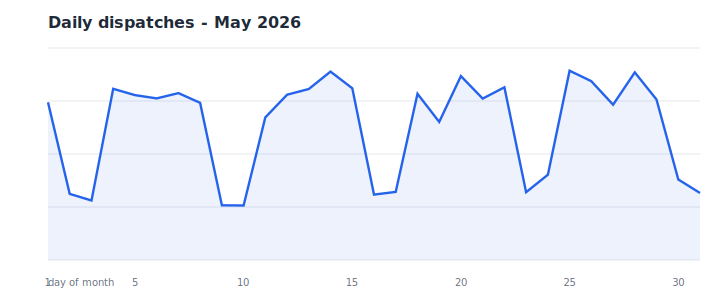
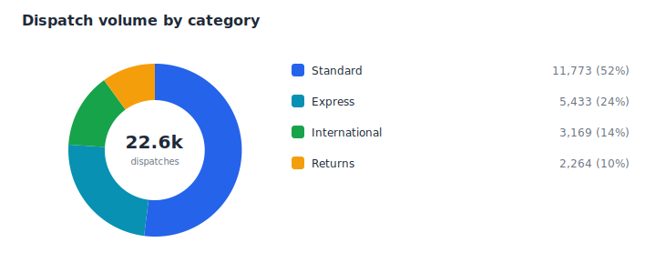
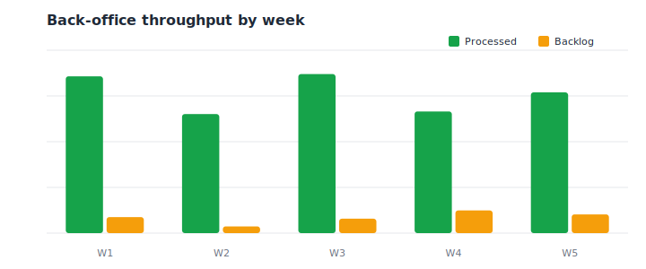

# Monthly Logistics Performance Report

A recurring workflow that turns raw operational logistics data into an **executive-ready PowerPoint deck** — and builds that deck programmatically, with native, editable charts.

> _Synthetic-data demo — built on randomly generated operational data. The real monthly report is confidential and **not** included here._

## Daily dispatches



## Volume by category



## Back-office throughput



## What it does

`build_report.py` generates a month of synthetic operations data, renders the three charts above, and assembles `logistics_report.pptx` with **native `python-pptx` charts** (line, doughnut, clustered column) plus a summary table — so the deck stays fully editable in PowerPoint rather than being flat images.

## Run it

```bash
pip install -r requirements.txt
python build_report.py
```

## Sample results (synthetic)

- **~22.6k dispatches** in the month
- Category mix: Standard ~52% · Express ~24% · International ~14% · Returns ~10%
- Weekly back-office **Processed vs Backlog** tracking

## Tech

`Python` · `python-pptx` (native charts) · `Excel` · dependency-free SVG charting

---

_Portfolio demo. No confidential information is included — every figure is randomly generated._
